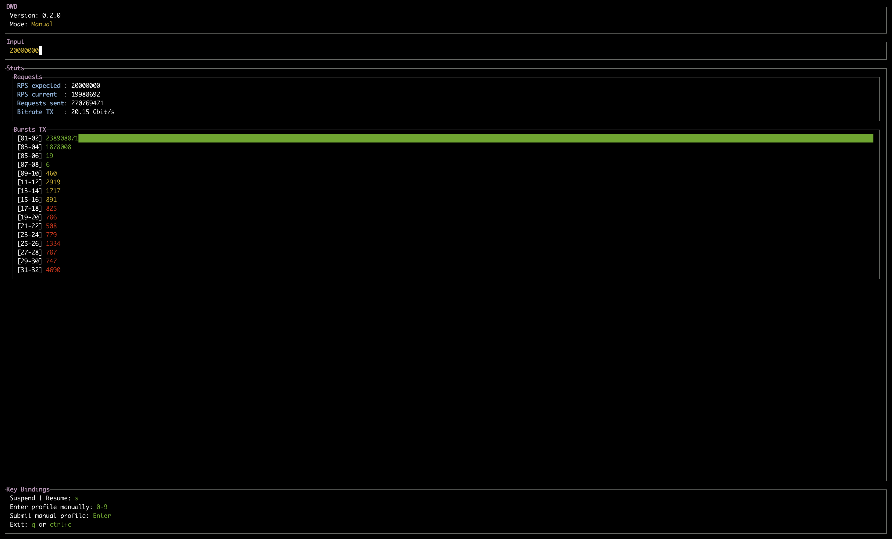
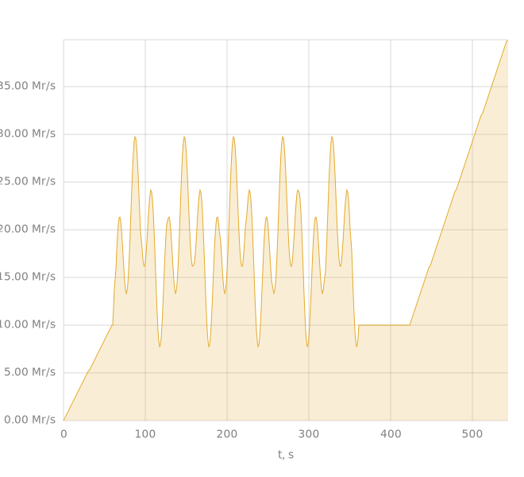

# DWD

DWD is a high-performance and flexible traffic generator. It allows generating both HTTP (right now actually not) and UDP, as well as any raw requests, utilizing the machine to the maximum.

There are two operating modes that are fundamentally different from each other in terms of the network stack used:
- The first uses the native network stack of the machine on which the DWD is deployed.
- The second - DPDK mode - allows you to bypass the kernel stack and use the network card directly.

Let's consider both modes in more detail.

## TL/DR examples

#### Load 16'000'000 UDP packets per second on 40 CPU cores

Type the following command:
```bash
dwd udp <IP:PORT>
```

The DWD control UI opens, where you can type the desired RPS.

#### Load 30'000'000 UDP packets per second on a single CPU core using DPDK mode

1. Install DPDK:
  
```bash
apt install -y libnuma1 libibverbs1
````

2. Mount hugepages:

```
mkdir -p /mnt/hugepages /mnt/hugepages-1G

mount -t hugetlbfs nodev /mnt/hugepages -o pagesize=2M
mount -t hugetlbfs nodev /mnt/hugepages-1G -o pagesize=1G

echo 1024 > /sys/kernel/mm/hugepages/hugepages-2048kB/nr_hugepages
echo 16 > /sys/kernel/mm/hugepages/hugepages-1048576kB/nr_hugepages
```

3. Prepare PCAP.

```python
#!/usr/bin/env python3

import random
from random import getrandbits
from ipaddress import IPv4Address, IPv6Address
from typing import List
from scapy.all import Packet, PcapWriter, Ether, IPv6, ICMPv6DestUnreach, UDP, Raw

COUNT = 64 * 1024


def write_pcap(path: str, packets: List[Packet]) -> None:
    with PcapWriter(path) as fh:
        for p in packets:
            fh.write(p)


packets = (
    Ether(dst="b8:59:9f:76:76:34", src="0c:42:a1:5a:3b:25")
    / IPv6(dst=f"<DESTINATION IP ADDRESS>", src=f"<SOURCE IP ADDRESS>")
    / UDP(dport=80, sport=random.randint(32768, 60999)) 
    / Raw("GET / HTTP/1.1\r\n\r\n")
    for i in range(COUNT)
)

write_pcap("example-udp.pcap", packets)
```

4. Prepare `dpdk.yaml`

```yaml
master_lcore: 0
ports:
  # PCI id of your device.
  0000:5e:00.1:
    # How many CPU cores we utilize.
    cores: [10]

```

5. Type the following command:

```bash
dwd dpdk --dpdk-path ./dpdk.yaml --pcap-path ./example-udp.pcap
```

6. Write the desired load in the UI:



7. You're awesome!

## Native network stack mode
Native mode utilizes the existing kernel network stack for packet generation/processing. That is, all TCP and UDP sockets are native, performance is increased due to carefully organized code, coroutines and multithreading.

This mode should be used when it is necessary to create a real load on the service in order to correctly form and parse requests via the HTTP protocol, or raw UDP packets.

On a machine with Intel(R) Xeon(R) Gold 6230 CPU @ 2.10GHz on board, one DWD is capable of generating, utilizing all 40 physical CPU cores:

- In UDP mode, about 16'000'000 UDP packets per second.

It works as follows.

The number of threads specified in the option is started (if not specified, the number of logical cores on the system is taken), and a certain number of asynchronous tasks (a-la coroutines) are started in each of them so that their total number is equal to the `concurrency` parameter.
Each asynchronous task in the cycle tries to generate requests in such a way as to fit into the load profile. It is also worth mentioning that before starting, each asynchronous task chooses a bind IP address for itself and requests will only come from it.
Ports are selected randomly from free ones. If the number of possible IP addresses is less than the number of tasks, some of them are reused. The [Leaky Token Bucket](https://en.wikipedia.org/wiki/Leaky_bucket) algorithm is used to maintain the load profile.

There is a possibility of bursts (grouping requests/packets into a bunch and sending them at once) to emulate situations of overflow of network card buffers.

If the `--requests-per-socket=N` option is specified, then every `N` requests the socket is recreated. The port is selected from free ones by the operating system.

## DPDK mode

In this mode, there is no kernel network stack - all packet preparation and processing occurs in user space by separating the network card from the kernel, with very careful tuning of the hardware on which the DWD is launched.
DPDK (Data Plane Development Kit) is used as a library for organizing the interaction between the code and hardware.

Raw pcap files with pre-crafted packets are used as a payload. It is important to pay attention to such things as correctly filled Ethernet and IP header fields, for example, the correct MAC address of the neighbor through which the traffic will go should be specified as the destination MAC address.

In addition to the packet file, the DWD also requires a hardware configuration file, which specifies which PCI devices should be taken from the core and on how many CPU cores the workers generating the load will be launched.

For example:

```yaml
master_lcore: 0
ports:
  0000:5e:00.0:
    cores: [2, 4, 6, 8]
```

Here, `macter_lcore` specifies the number of the logical core on which the controlling worker will be launched, and under each PCI device key, the numbers of the cores on which the sending/receiving of packets will be carried out are also described.

Packets from a given file are distributed evenly among workers before shooting (the first packet to the first, the second to the second, etc.), and when all the packets are distributed, they will be released in a cycle within their worker.

## Load profiles
A load profile is a declarative description of how the load should be generated and for how long.

Usually we want the load created on the target system to obey some laws. For example, to be increased linearly over some time from zero to the expected value, and then remain at the achieved value for some time.
In other words, we want control.

Load profiles solve this problem by describing **generators**, each of which is a pre-prepared module that can say how many number of requests per second the system should generate at a certain point in time.

Profiles are specified separately as YAML files. Almost every generator type, except for `seq` and `sum` (which are aggregation), requires a `duration` parameter, which says how many seconds the load should be generated.

#### Const
Holds the specified constant load for the specified time.

Example configuration where we want to supply a load of 1'000'000 RPS for 60 seconds:

```yaml
type: const
rps: 1000000
duration: 60
```

#### Line
A linear function that monotonically increases or decreases over a specified rps interval.

The most commonly used profile type, and probably the most useful. It is specified by two points - the beginning and the end.

An example of a config in which the load increases from 0 to 5'000'000 RPS over 5 minutes (300 sec):

```yaml
type: line
rps: [0, 5000000]
duration: 300
```

#### Sine

Sine function.

This is a bit more complicated, since it is not convenient to specify a pure sine from the point of view of boundary conditions, especially when they are non-zero.
In other words, it is difficult to predict in advance at what RPS the profile will start and end at a given time. 

Therefore, the load profile is specified by specifying boundary conditions, minimum and maximum RPS, from which the amplitude is calculated, and an approximate phase. The current period is calculated analytically at the moment of generator initialization.

A configuration example:

```yaml
type: sin
pps: [1000000, 1000000]
pps_min: 500000
pps_max: 2500000
approximate_period: 30
duration: 60
```

#### Seq

Combines several generators into a chain.

Described as a combination of generators of other types, the order in which the generators are turned on corresponds to how they are described, i.e. the first generator will be turned on first, then the second, etc.

Any level of nesting is allowed. For example, a nested generator can also be of the `seq` type and have other nested generators underneath it.

In this case, the total operating time of the generator is equivalent to the sum of the operating times of each nested generator.

An example where the load first grows linearly, then remains at a given level, and then decreases to zero:

```yaml
type: seq
generators:
- type: line
  rps: [0, 2000000]
  duration: 60
- type: const
  rps: 2000000    
  duration: 60
- type: line
  rps: [2000000, 0]
  duration: 60
```

#### Sum

Parallel combination of several generators into a sum.

Useful when more complex load profiles are needed. In this case, it is theoretically possible to describe any profile from the sum of sines by expanding the original function into a Fourier series.

The total generator operating time is calculated as the maximum operating time of the nested generators. It is not necessary to adjust the duration parameter - if one of the nested generators has finished working, it will be considered to generate zero. Sum values ​​less than zero automatically become zero.

An example of the sum of two sines of different frequencies:

```yaml
type: sum
generators:
- type: sin
  pps: [1000000, 1000000]
  pps_min: 500000
  pps_max: 1500000
  approximate_period: 60
  duration: 600
- type: sin
  pps: [500000, 500000]
  pps_min: 250000
  pps_max: 1500000
  approximate_period: 10
  duration: 600
```

### Example

Let's look at an example of a profile that uses all of the above primitives.

We want the load to consist of four stages:

- In the first - it grew linearly from 0 to 10'000'000 RPS in 60 seconds.
- In the second - for 300 seconds there was a sum of two sines with boundary conditions of 10'000'000 RPS at both ends, but with different amplitude and frequency.
- In the third - a constant load of 10'000'000 RPS for 60 seconds
- In the fourth - it grew linearly from 10'000'000 RPS to 40'000'000 RPS in 120 seconds.

Thus, the total generator operating time will be 60 + 300 + 60 + 120 = 540 seconds.

Then the configuration will look like this:

```yaml
type: seq
generators:
  - type: line
    rps: [0, 10000000]
    duration: 60
  - type: sum
    generators:
    - type: sin
      pps: [5000000, 5000000]
      pps_min: 5000000
      pps_max: 15000000
      approximate_period: 60
      duration: 300
    - type: sin
      pps: [5000000, 5000000]
      pps_min: 2500000
      pps_max: 15000000
      approximate_period: 20
      duration: 300
  - type: const
    rps: 10000000
    duration: 60
  - type: line
    rps: [10000000, 40000000]
    duration: 120
```

The resulting load profile in this case will look like:

